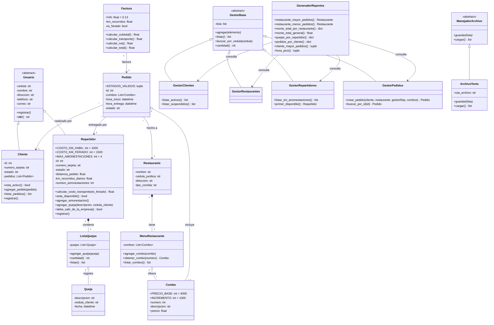

# Diagrama de Clases — CletaEats

Diagrama UML del modelo de dominio (paquete `Modelo/`), con atributos,
métodos principales y relaciones entre clases (herencia, composición,
agregación y asociación con multiplicidad).

## Notas de diseño

- **Herencia:** `Usuario` es una clase abstracta (`ABC`) que centraliza los
  campos comunes de `Cliente` y `Repartidor` (cédula, nombre, dirección,
  teléfono, correo) y obliga a implementar `registrar()`. `GestorBase` sigue
  el mismo patrón para los cuatro gestores, y `ManejadorArchivo` define el
  contrato de persistencia que implementa `ArchivoTexto`.
- **Composición:** `Restaurante` es dueño de su `MenuRestaurante`, y
  `Repartidor` es dueño de su `ListaQuejas` — si el contenedor desaparece,
  las partes no tienen sentido fuera de él.
- **Agregación:** `MenuRestaurante` agrega `Combo`s y `ListaQuejas` agrega
  `Queja`s — colecciones de objetos con identidad propia.
- **Asociación:** `Pedido` referencia a `Cliente`, `Restaurante` y
  `Repartidor` (múltiples pedidos por cada uno), y `Factura` se asocia 1 a 1
  con el `Pedido` que factura.
