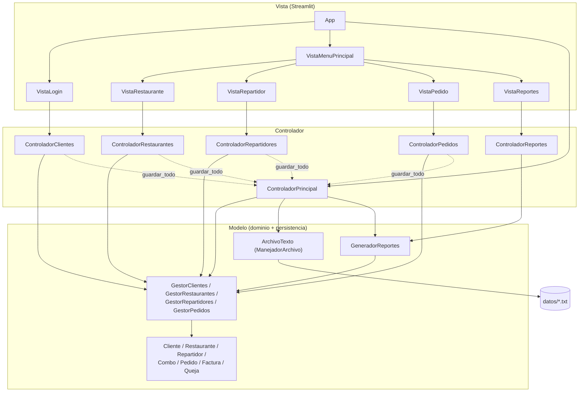

# Diagrama de Relaciones — Arquitectura CletaEats

Diagrama de relaciones entre los componentes del sistema (arquitectura
MVC): qué capa depende de cuál, y qué clase concreta de cada capa se
apoya en cuál del nivel inferior.

## Cómo leerlo

- **Vista → Controlador:** cada vista de Streamlit solo conoce el
  controlador específico que necesita (p. ej. `VistaPedido` solo habla con
  `ControladorPedidos` y `ControladorRestaurantes`), nunca accede al Modelo
  directamente.
- **Controlador → Modelo:** cada controlador delega toda la lógica de
  negocio (validaciones, reglas de asignación de repartidor, cálculo de
  factura) en los Gestores y entidades del Modelo — el Controlador solo
  coordina y traduce errores a mensajes para la Vista.
- **Persistencia:** `ControladorPrincipal` es el único punto que sabe de
  archivos. Los demás controladores le avisan (`guardar_todo()`) cada vez
  que una operación modifica clientes, restaurantes o repartidores, para
  que el cambio quede en `datos/*.txt` y sobreviva a un reinicio.
